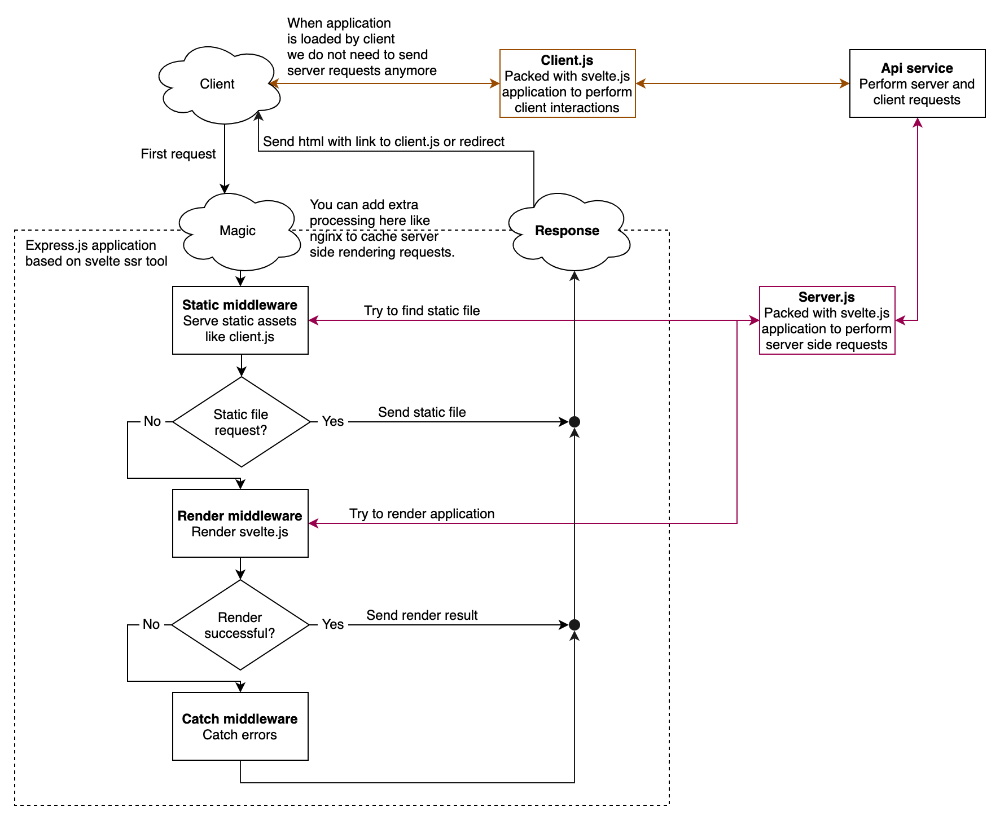

# Svelte server side rendering tool
This tool gives an ability to run [express.js](https://expressjs.com/) server to render [svelte.js](https://svelte.dev/) application on server side with functionality to preload [svelte.js](https://svelte.dev/) application data via api requests before send response to client.

Take a look at fully packed example of integration with webpack in [svelte-ssr-template-webpack](https://github.com/gustarus/svelte-ssr-template-webpack).

⚠️ Currently this tool supports only [webpack.js](https://webpack.js.org/) assets bundler.

## How it works?
You can run this tool in production or development modes.

### How it works in production mode?
Firstly you have to build your app with assets bundler.
As output you need `client.js` and `server.js`.
Then you need to start `server.js` with `node.js` and this service will perform server side rendering requests.


### How it works in development mode?
In development mode this tool will launch development server for `client.js` and `server.js` and `node.js` service to perform server side rendering requests.

## How to install it?
**1. Install via `npm`**
```bash
npm install --save svelte-ssr
```

## How to setup it?
**1. Create `index.html` file inside `src` folder**
```html
<!DOCTYPE html>
<html lang="ru">
  <head>
    <meta charset="UTF-8" />
  </head>

  <body>
    <div id="root"></div>
  </body>
</html>
```

**1. Create `App.svelte` file inside `src` folder**
````html
<script context="module">
  /**
   * @param {{ base: string, path: string, inner: string, query: {} }} location - requested location
   * @param {resolveCallback} resolve - resolve prepared result
   * @param {{ redirect: redirectCallback }} helpers - preload helpers
   * @returns any
   */
  export async function preload(location, resolve, helpers) {
    // preload data with api requests for example via `axios`
    return { preloaded: { foo: 'bar' } };
  }
  /**
   * Return resolved candidate.
   * @callback resolveCallback
   * @param {any} candidate
   * @param {callback} prepare
   */
  /**
   * Return redirect instance.
   * @callback redirectCallback
   * @param {number} status
   * @param {string} url
   */
</script>

<script>
  // `client`, `server` or `node`
  export let entry = process.env.ENTRY;

  // this property will be available
  // only in server side rendering scenario
  export let path = undefined;
  
  // data which has been preloaded
  // from the preload method
  export let preloaded = {};
</script>

<div id="app">
  <!-- render content -->
</div>
````

**3. Create `server.js` file inside `src` folder**
```javascript
import path from 'path';
import {
  createCatchMiddleware,
  createRedirectMiddleware,
  createRenderMiddleware,
  createServer,
  createStaticMiddleware,
  resolveCommandOptions
} from 'svelte-ssr/server';
import component, { preload } from './App.svelte';

// create plain express server
const app = createServer();

// resolve command line arguments
const { port, base, staticProxyPort, staticPathToDirectory } = resolveCommandOptions();

// serve static content with the magic middleware
// if both development severs are running - this middleware
// serve files from client development server port
app.use(createStaticMiddleware({ base, staticProxyPort, staticPathToDirectory, verbose: true }));

// serve content to render based on desired template
// and render request content inside the target
const targetSelector = '#root';
const pathToTemplate = path.resolve(__dirname, '..', 'build', 'client', 'index.html');
app.use(createRenderMiddleware({
  base,
  component,
  preload,
  pathToTemplate,
  targetSelector,
  verbose: true,
  debug: true
}));

// redirect all not resolved requests to the base
app.use(createRedirectMiddleware({ base, verbose: true }));

// log into console all errors
app.use(createCatchMiddleware({ verbose: true }));

// listen desired port by the server
app.listen(port, () => console.log(`Server is ready on ':${port}'`));
```

**4. Create `client.js` file inside `src` folder**
```javascript
// import core dependencies
import { renderClient } from 'svelte-ssr/client';
import component from './App.svelte';

// import application styles
import './styles/global.pcss';

// render application inside the target
renderClient({ component, target: '#root' });
```

**5. Create `webpack.config.server.js` file**
```javascript
const path = require('path');
const { createWebpackServerConfig } = require('svelte-ssr/webpack');

const config = production => createWebpackServerConfig({
  resolve: {
    extensions: ['.mjs', '.js', '.svelte', '.json'],
    alias: {
      svelte: path.resolve(__dirname, 'node_modules', 'svelte')
    }
  },

  module: {
    rules: [
      {
        test: /\.svelte$/,
        use: {
          loader: 'svelte-loader',
          options: {
            emitCss: false,
            generate: 'ssr',
            hydratable: true,
            hotReload: true,
            dev: !production,
            preprocess: require('svelte-preprocess')({ postcss: true })
          }
        }
      },
      {
        test: [/\.css$/, /\.pcss$/],
        loader: 'null-loader'
      }
    ]
  }
}, { production });

module.exports = (_, { mode }) => {
  return config(mode === 'production');
};
```

**6. Create `webpack.config.client.js` file**
```javascript
const path = require('path');
const HtmlWebpackPlugin = require('html-webpack-plugin');
const MiniCssExtractPlugin = require('mini-css-extract-plugin');
const { addWebpackProductionHash, createWebpackClientConfig } = require('svelte-ssr/webpack');

const config = production => createWebpackClientConfig({
  resolve: {
    extensions: ['.mjs', '.js', '.svelte', '.json'],
    alias: {
      svelte: path.resolve(__dirname, 'node_modules', 'svelte')
    }
  },

  module: {
    rules: [
      {
        test: /\.svelte$/,
        use: {
          loader: 'svelte-loader',
          options: {
            emitCss: true,
            hydratable: true,
            hotReload: true,
            dev: !production,
            preprocess: require('svelte-preprocess')({ postcss: true })
          }
        }
      },
      {
        test: [/\.css$/, /\.pcss$/],
        use: [
          {
            loader: MiniCssExtractPlugin.loader,
            options: { hmr: !production }
          },
          'css-loader',
          'postcss-loader'
        ]
      }
    ]
  },

  plugins: [
    new MiniCssExtractPlugin({
      filename: addWebpackProductionHash('[name].css', production)
    }),

    new HtmlWebpackPlugin({
      inject: true,
      template: path.resolve(__dirname, 'src', 'index.html')
    })
  ]
}, { production });

module.exports = (_, { mode }) => {
  return config(mode === 'production');
};
```

**6. Add the following scripts tou your `package.json` file**
```json
{
  "scripts": {
    "start": "node ./node_modules/svelte-ssr/build/cli.js development -b webpack -c webpack.config.client.js -s webpack.config.server.js",
    "build": "node ./node_modules/svelte-ssr/build/cli.js build -b webpack -c webpack.config.client.js -s webpack.config.server.js",
    "production": "node ./node_modules/svelte-ssr/build/cli.js production -b webpack -c webpack.config.client.js -s webpack.config.server.js"
  }
}
```

**7. Run in `development` mode**
```bash
npm run start
```

**8. Run in `production` mode**
```bash
npm run build
npm run production
```

## How to configure it?
This tool has a help to display all supported commands and options.
```bash
$ ./node_modules/.bin/svelte-ssr help  
Usage: svelte-ssr [options] [command]

Tool to launch server side rendering service

Options:
  -V, --version          output the version number
  -h, --help             output usage information

Commands:
  build [options]        Build client and server entries
  development [options]  Launch client and server development servers and node server to serve server side rendering
  production [options]   Launch node server to serve server side rendering
```

### Build command
```bash
$ ./node_modules/.bin/svelte-ssr build --help
Usage: svelte-ssr build [options]

Build client and server entries

Options:
  -b, --bundler <webpack>                 Which tool to use to bundle assets (only webpack is supported right now)
  -c, --client-config <config.client.js>  Path to bundler tool client config
  -s --server-config <config.server.js>   Path to bundler tool server config
```

### Development command
```bash
$ ./node_modules/.bin/svelte-ssr development --help
Usage: svelte-ssr development [options]

Launch client and server development servers and node server to serve server side rendering

Options:
  -b, --bundler <webpack>                 Which tool to use to bundle assets (only webpack is supported right now)
  --base </>                              Base html tag to listen for the server
  -p --node-port <3000>                   Port to listen for server side rendering server
  -c, --client-config <config.client.js>  Path to bundler tool client config
  --client-port <8080>                    Port to listen for client bundler
  -s --server-config <config.server.js>   Path to bundler tool server config
  --server-port <8081>                    Port to listen for server bundler
```

### Production command
```bash
$ ./node_modules/.bin/svelte-ssr production --help
Usage: svelte-ssr production [options]

Launch node server to serve server side rendering

Options:
  -b, --bundler <webpack>                 Which tool to use to bundle assets (only webpack is supported right now)
  --base </>                              Base html tag to listen for the server
  -p --node-port <3000>                   Port to listen for server side rendering server
  -c, --client-config <config.client.js>  Path to bundler tool client config
  -s --server-config <config.server.js>   Path to bundler tool server config
```
